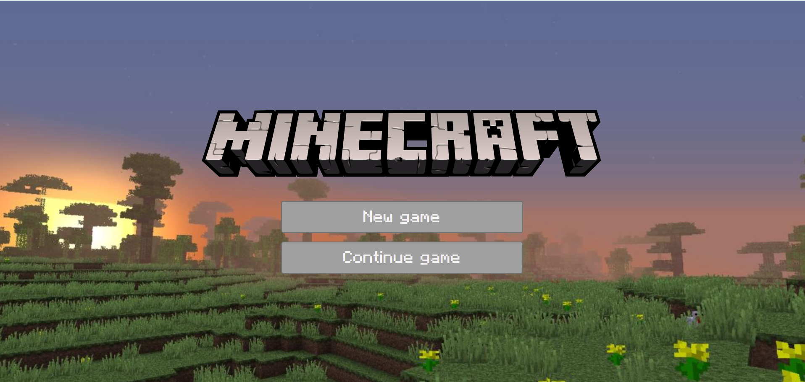
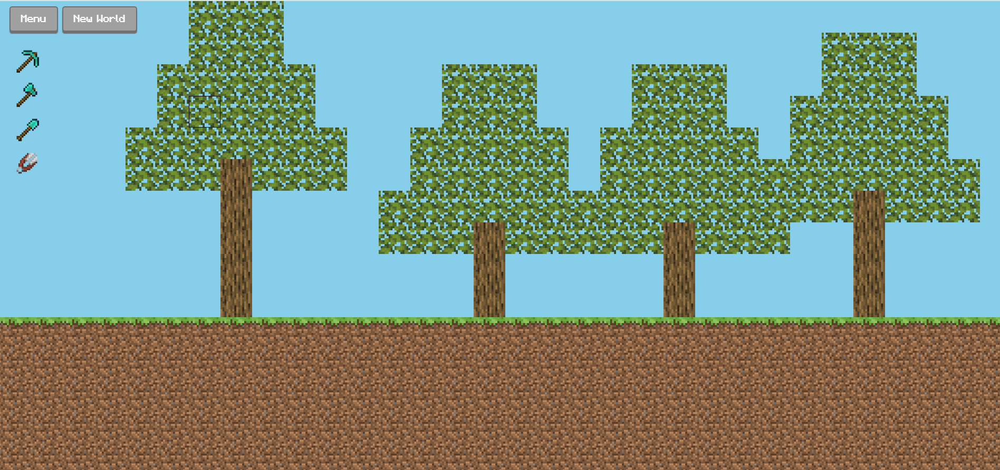

# Mine-Craft


**Mine-Craft** הוא משחק 2D בו השחקן יכול לחפור, לכרות ולבנות עולם משלו באמצעות כלים שונים. כל כלי מיועד למטרה ספציפית: גרזן לכריתת עצים, קנמל לכריתת סלעים, את החפירה לחפירת אדמה ודשא, ומספריים לכריתת עלים. השחקן אוסף משאבים ומשתמש בהם לבנייה בעולם המשחק הדינמי.

---

##  צילומי מסך

**מסך פתיחה**  



**מסך משחק**  


---

##  תכונות עיקריות (Features)

- עולם דו-ממדי עם אדמה, דשא, עצים וסלעים
- מערכת כלים ייחודית לכל סוג פעולה
- איסוף משאבים ויכולת לבנות באמצעותם
- ממשק ידידותי עם בחירת כלים על המסך
- שמירת מצב המשחק והמשך משחק

---

##  התקנה (Installation)

1. הורד או שכפל את הפרויקט:
   ```bash
   git clone https://github.com/username/mine-craft.git
